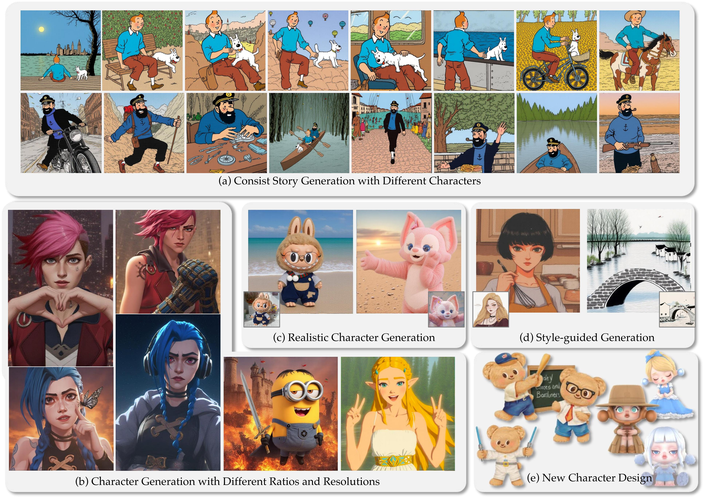

# Bringing Characters to New Stories: Training-Free Theme-Specific Image Generation via Dynamic Visual Prompting

>**Abstract**:  
> The stories and characters that captivate us as we grow up shape unique fantasy worlds, with images serving as the primary medium for visually experiencing these realms. Personalizing generative models through fine-tuning with theme-specific data has become a prevalent approach in text-to-image generation. However, unlike object customization, which focuses on learning specific objects, theme-specific generation encompasses diverse elements such as characters, scenes, and objects. Such diversity also introduces a key challenge: how to adaptively generate multi-character, multi-concept, and continuous theme-specific images (TSI). Moreover, fine-tuning approaches often come with significant computational overhead, time costs, and risks of overfitting. This paper explores a fundamental question: Can image generation models directly leverage images as contextual input, similarly to how large language models use text as context? To address this, we present T-Prompter, a novel training-free TSI method for generation. T-Prompter introduces visual prompting, a mechanism that integrates reference images into generative models, allowing users to seamlessly specify the target theme without requiring additional training. To further enhance this process, we propose a Dynamic Visual Prompting (DVP) mechanism, which iteratively optimizes visual prompts to improve the accuracy and quality of generated images. Our approach enables diverse applications, including consistent story generation, character design, realistic character generation, and style- guided image generation. Comparative evaluations against state-of-the-art personalization methods demonstrate that T-Prompter achieves significantly better results and excels in maintaining character identity preserving, style consistency and text alignment, offering a robust and flexible solution for theme-specific image generation.

## Description
Official Implementation.

## TODO:
- [ ] Release code
- [ ] Release dataset
